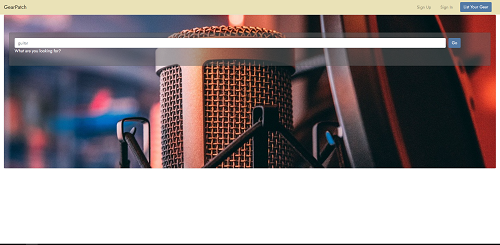
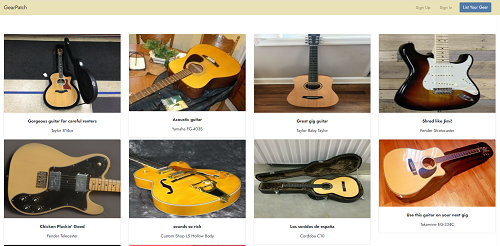
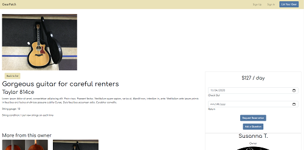
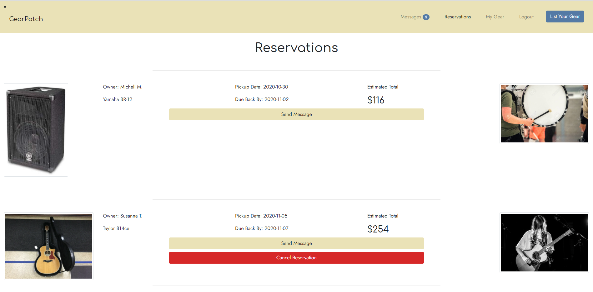
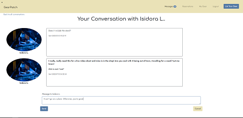

# GearPatch
## Connecting you to the gear you need
By David Larsen

### Overview
GearPatch is a peer-to-peer rental platform that lets musicians make extra money off of their gear. Through GearPatch, they can connect with other musicans who can use the gear short-term for a reasonable fee. This is accomplished through the application's internal messaging system, allowing the two users to communicate and set up a ```Reservation``` to rent the gear. With a confirmed reservation, the two parties can arrange drop-off/pick-up and method of payment.

### Features
- A search which allows any user to see the data available
- Means for registered users to message each other or request reservations with live notifications
- Gear owners can confirm reservations and mark items returned after the rental
- Ability for registered users to list gear for sale and edit those listings (CRUD)

### Screenshots
This application is responsive to work with desktop and mobile viewports.
<p>
    
    
    
    
    
</p>

### Installation
1. Clone this repostory to your local hard drive.
2. Run the SQL scripts in order (```01...```, ```02...```) to build the database on an initialized SQL server.
3. Navigate to the ```GearPatch/client``` directory and type ```npm install .``` to install dependencies.
4. Run the API by typing ```dotnet run``` in the root directory, or through Visual Studio debugger.
5. To create accounts and sign in, you will need an active ```Firebase``` account.  See below.
5. Once the API has begun, run ```npm start``` from the ```GearPatch/client``` directory.
6. The app is now running, and the search function is active. To send messages, list gear, or make reservations, you will need to create an account through the ```Sign Up``` option in the navbar.

#### To create a Firebase account
1. Go to [firebase.google.com](https://firebase.google.com "Go to Firebase")
2. Create an account, then create a new project
3. Make sure your Firebase project is set up for Email/Password authentication.
4. Find your Firebase Project ID, and copy it to ```appsettings.json``` in the ```GearPatch``` directory.
5. Find your Firebase API Key, and copy it to a new ```.env``` file in the ```GearPatch/client``` directory. The format for this is: ```REACT_APP_API_KEY=abcdefghijklmnopqrstuvwxyz12```

### Planning Tools
[DbDiagram ERD](https://dbdiagram.io/d/5f9097f93a78976d7b78a2b4)
[Figma Wireframe](https://www.figma.com/file/WxY7OAtiweLJUaxJ005ACq/Final-Capstone?node-id=0%3A1)
